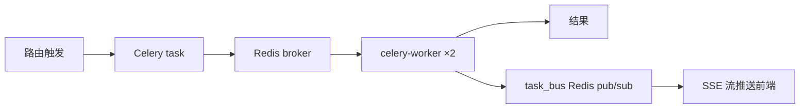

# ARCHITECTURE — Local_AI 深度架构

逐层架构说明：请求流、模块职责、关键设计模式、数据流。配合 [`MANIFEST.md`](MANIFEST.md)（模块清单）与 [`AGENTS.md`](AGENTS.md)（开发命令/约定）阅读。

---

## 系统总览

**Local_AI** 是面向中国招标代理业务的 AI 平台。Flask 后端 + SPA 前端，5 个 LLM 提供商，PostgreSQL 存储，Celery 异步重型任务。

```
┌──────────────────────────────────────────────────────────────┐
│  前端 SPA (templates/index.html + static/js/app.js ~10k行)    │
│  流式聊天 · 文件管理 · 知识库 · 清标 · 合规 · Wiki · 项目       │
└──────────────┬───────────────────────────────────────────────┘
               │ HTTP/SSE (nginx HTTPS, 12G body limit)
┌──────────────▼───────────────────────────────────────────────┐
│  Flask App Factory (app/__init__.py:create_app)               │
│    → 17 Blueprints (app/routes/)       → HTTP 端点             │
│    → 86 Services (app/services/)       → 业务逻辑层            │
│    → database.py (psycopg2 连接池)     → 70 表初始化            │
│    → globals.py (全局单例) → config.py → cleanup_tasks.py       │
│    → celery_app.py (Celery 异步任务)                           │
│    → templates/index.html (SPA) → static/ (JS/CSS/PWA)         │
└──────┬──────────────────────┬─────────────────────────────────┘
       │                      │
┌──────▼───────┐   ┌──────────▼───────────────┐
│ PostgreSQL 16 │   │ Redis 7 + Celery 5       │
│ 70 张表       │   │ broker + beat + 缓存      │
└──────────────┘   └──────────────────────────┘
```

## 请求生命周期

1. **HTTP 请求** → nginx（HTTPS 终结，12G body limit）→ gunicorn（4 workers, gevent, 120s timeout）
2. **Flask** → `create_app()` 注册 17 Blueprint → 路由分发
3. **路由层**（`app/routes/`）→ 参数校验 + 权限检查 → 调用服务层
4. **服务层**（`app/services/`）→ 业务逻辑 → DB（`database.py` 连接池）或 LLM（`llm_provider.py` + fallback）
5. **响应** → `ok()`/`err()` 标准化 JSON（`app/utils/helpers.py`）
6. **长任务**（清标/深度分析/审计）→ Celery 异步 + `task_bus.py`（Redis pub/sub）→ SSE 流式推送进度

## 应用工厂 `app/__init__.py`

`create_app()` 是唯一入口，职责：

- 加载 `.env`，校验 `SECRET_KEY`/`FLASK_SECRET_KEY`（缺失则启动失败）
- Filesystem session（30 天）；CSRF opt-in（`WTF_CSRF_CHECK_DEFAULT=False`）
- Flask-Limiter（Redis 后端，全局 120/min；聊天 30/min、上传 10/min、登录 5/min）
- Admin 密码从 `ADMIN_PIN` 自动 hash
- 413 错误处理器、cache buster、Swagger
- 注册 17 Blueprint（`register_all()`）
- APScheduler 20+ 定时任务（`cleanup_tasks.py`）
- `init_services()`：PG 表初始化、WebDriver 延迟加载、LangGraph checkpointer

## 数据库层 `app/database.py`

- psycopg2 `SimpleConnectionPool`（min 1, max 20）
- 三级连接参数获取：`PG_*` → `DATABASE_URL` → fallback
- 健康检查 + 自动重连（checkout 时 `SELECT 1`，stale 连接关闭后重试一次）
- 事务 manager context manager
- **Schema 策略**：`init_postgres_tables()` 幂等 `CREATE TABLE IF NOT EXISTS` + `ALTER TABLE`
  → `migrations/001_initial_snapshot.sql` 是无操作标记，实际 schema 在代码里
- Advisory lock (732014) 防并发初始化

## 服务层核心设计

### 1. LLM 多供应商路由 `llm_provider.py` + `llm_fallback.py`
- 5 供应商：DeepSeek / 智谱 / 通义 / SiliconFlow / Mimo
- fallback 链：指数退避 + 熔断器
- prompt 安全层 `prompt_safety.py`：注入防护 + anti-hallucination
- `agent_middleware.py`：InvalidToolGuard 幻觉工具调用防护

### 2. LangGraph 代理 `agent.py`
- Bocha 搜索 + get_date 工具，72h 缓存
- System prompt 从 `data/agent_prompt.json` 加载（支持在线编辑），自动追加安全防护

### 3. 文档解析 `file_processing.py`
- 全格式提取：PDF（MinerU 优先）/ DOCX / XLSX / PPTX / 扫描件 OCR（RapidOCR）
- 文本相似度：TF-IDF cosine + 中文停用词 + 模板去除
- VL 描述 + 熔断器
- 21 处导入点（高耦合，审计决定保留不拆）

### 4. 清标引擎 `clearance_engine.py` + `document_analysis_svc.py`
5 维度并行（Celery）：
- **指标分析**：46 指标（`indicator_defs.py`）+ 0-100 权重复合评分
- **交叉比较**：RiskScorer + TF-IDF + 组件守卫（FIX-014）
- **合规检查**：`compliance_checker.py`
- **AI 审查**：judge 模型二次审查
- **全量审计补充**：`audit_engine.py`

评分体系详见 `AGENTS.md` §清标评分。

### 5. 串通投标检测 `batch_orchestrator.py`
- RiskScorer（0.375 key + 0.375 attr + 0.25 text）
- TF-IDF 文本相似度（≥80% 门槛）
- 组件守卫 `_detect_component`：价格标/技术标/商务标异组件归零
- gang detection（社区检测）+ 报价异常（Benford/尾数/等差等比）

### 6. RAG `rag_engine.py`
- extract → chunk → embed → ChromaDB（4 collection, LRU 5000）
- 复用 `paraphrase-multilingual-MiniLM-L12-v2`

## 异步任务系统



- `celery_app.py`：Redis broker+backend，JSON 序列化，Asia/Shanghai 时区，10min/15min 超时，6 beat 调度
- `task_bus.py`：异步任务总线（Redis pub/sub → SSE），支持预注册（FIX-007 竞态修复）
- 定时任务：OCR、skill 提取、RAG 索引、夜间训练、周/月/年报

## 调度器

| 场景 | 调度器 |
|---|---|
| 本地开发 | APScheduler（进程内，`ENABLE_SCHEDULER=true`） |
| Docker | Celery Beat（`celery-beat` 服务）替代 APScheduler |
| 多 worker | 必须 `ENABLE_SCHEDULER=false` 避免重复任务 |

## 关键设计模式

| 模式 | 位置 | 说明 |
|---|---|---|
| App Factory | `app/__init__.py` | 标准可测试 |
| Blueprint 分层 | `app/routes/` | 17 蓝图职责明确 |
| Composition | `compliance_checker` + `TemplateDeviationChecker` | 避免 God class |
| 三级 DB 连接 | `database.py` | 环境→URI→fallback |
| 熔断器 | `llm_fallback.py` / VL | 外部依赖保护 |
| 路径可移植 | `config.py:to_rel_path/resolve_path` | 跨机器路径透明 |
| 回收站 | `recycle_bin_service.py` | 4 表 + 递归恢复 + 过期清理 |
| Fix Registry | `data/fix_registry.yaml` | 修复不变异（pre-commit 校验） |
| 会话连续性 | `/resume /save /recall` | 跨会话持久化 |

## 数据流示例：清标全流程

1. 用户上传文件 + 可选开标信息表
2. `POST /clearance` → Celery `clearance_engine.py` 启动 5 维度并行
3. 指标分析：`document_analysis_svc` → `_run_cross_comparison` / 46 指标打分
4. 交叉比较：`batch_orchestrator.compute_all_pairs` → TF-IDF + RiskScorer + 组件守卫
5. 结果 → `task_bus` SSE 推送 → 前端聊天气泡渲染（`CLEARANCE_REPORT` marker）
6. 落库 `chat_messages`，可下载 DOCX 报告

## 模块规模 Top 5

| 文件 | 行数 | 说明 |
|---|---|---|
| `static/js/app.js` | 9,798 | 主 SPA |
| `app/routes/admin.py` | 1,653 | 管理路由（曾 4,820，已拆分） |
| `app/services/file_processing.py` | 1,551 | 文档处理 |
| `app/services/document_analysis_svc.py` | 1,288 | 清标分析 |
| `app/routes/chat.py` | 1,122 | 聊天路由（曾 2,025，已拆分） |

---

*架构文档基于 2026-08-27 审计归纳，2026-09-01 正规化。*
